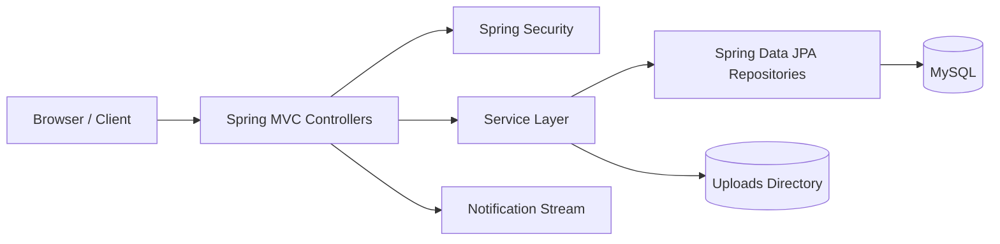
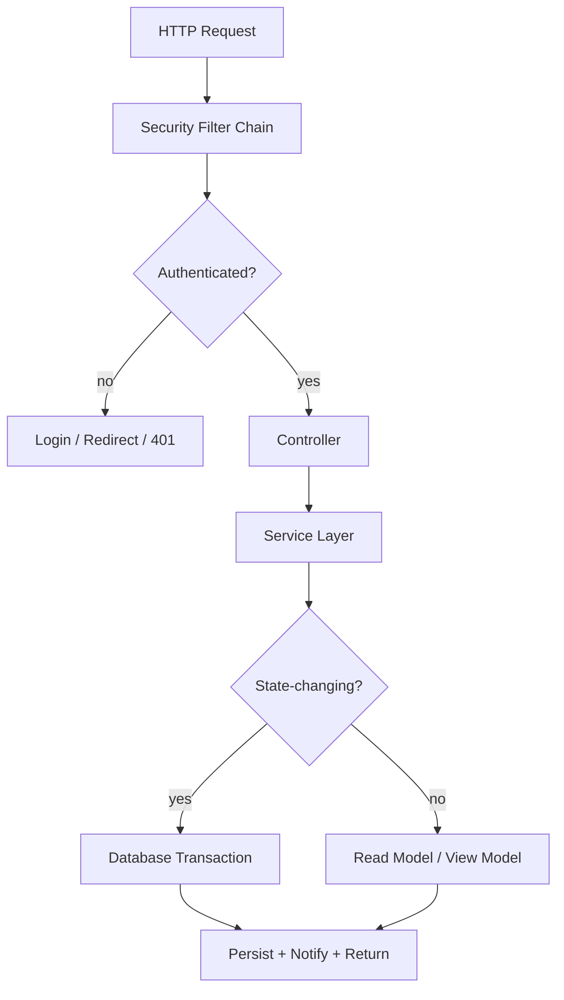
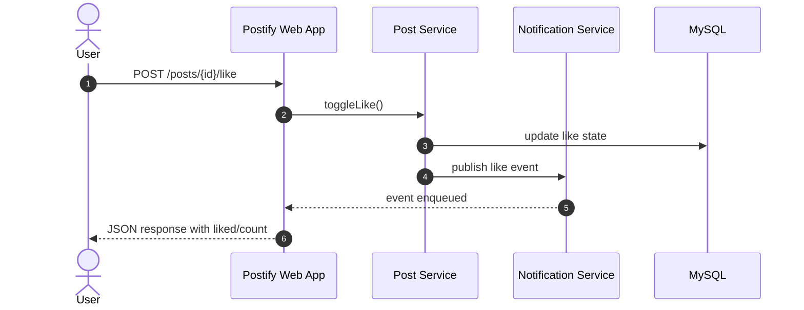

# Postify

Production-oriented social media platform built with Spring Boot, Spring Security, Thymeleaf, Spring Data JPA, MySQL, and Flyway. Postify covers the full user journey: registration, login, feeds, posts, profiles, follows, comments, likes, notifications, and admin moderation.

## Overview

Postify is designed to demonstrate a realistic web application architecture, not just a CRUD demo:

- Session-based authentication with Spring Security form login
- Role-based access control for admin workflows
- Paginated home feed with keyword search
- User profiles with avatar upload and bio editing
- Post creation and deletion with optional image uploads
- Like and comment interactions exposed as JSON endpoints
- Follow / unfollow flows with notification fan-out
- Server-Sent Events notification stream for live updates
- Admin dashboard, user management, and audit logs
- Flyway-managed schema migrations and validation-first database bootstrapping

## Architecture

### High-Level View



### Request Boundary



### Social Interaction Flow



## Tech Stack

- Java 21
- Spring Boot 4.0.0
- Spring MVC
- Spring Security
- Spring Data JPA / Hibernate
- Thymeleaf
- MySQL
- Flyway
- H2 for tests
- JUnit 5, Spring Test, MockMvc
- Lombok

## Core Domain Rules

- Public pages include the home feed, login, registration, search, and public profile views.
- Authenticated users can create posts, like posts, comment on posts, follow users, and edit their own profile.
- Admin users can manage users, promote users, delete users, and review admin logs.
- Post and avatar images are stored on disk under the `uploads/` directory.
- The home feed is paginated and supports keyword filtering.
- Comments, likes, and follow actions can trigger user notifications.
- Notification delivery is exposed through an SSE stream at `/notifications/stream`.

## Security Model

- Public routes:
  - `GET /`
  - `GET /login`
  - `GET /register`
  - `POST /register/add`
  - `GET /profile/**`
  - `GET /search/**`
  - Static assets under `/css/**`, `/js/**`, and `/images/**`
- Admin routes:
  - `/admin/**`
- All other application routes require authentication.
- Logout is handled at `POST /logout` through Spring Security.

Authorization is session-based. The app currently uses Spring Security form login rather than a bearer-token API flow.

## Endpoints

### Home

- `GET /` - paginated feed with optional keyword search

### Authentication

- `GET /login`
- `GET /register`
- `POST /register/add`
- `POST /logout`

### Profiles

- `GET /profile/{username}`
- `GET /profile/edit`
- `POST /profile/edit`

### Posts

- `POST /posts/create`
- `POST /posts/delete/{postId}`

### Reactions

- `GET /posts/{postId}/comments`
- `POST /posts/{postId}/comments`
- `POST /posts/{postId}/like`

### Social Graph

- `POST /follow/{username}`

### Search

- `GET /search?q={query}`

### Notifications

- `GET /notifications/stream`

### Admin

- `GET /admin`
- `GET /admin/dashboard`
- `GET /admin/users`
- `POST /admin/users/promote/{id}`
- `POST /admin/users/delete/{id}`
- `GET /admin/logs`

## Example Interactions

### Add a Comment

```http
POST /posts/42/comments
Content-Type: application/x-www-form-urlencoded

content=Great+post
```

Response: JSON payload containing the comment id, author, avatar, content, and timestamp.

### Toggle a Like

```http
POST /posts/42/like
```

Response:

```json
{
  "liked": true,
  "count": 17
}
```

### Subscribe to Notifications

```http
GET /notifications/stream
```

This endpoint returns an SSE stream for the authenticated user.

## Environment Variables

Configured through `.env`, imported with `spring.config.import=optional:file:.env`.

```properties
DB_URL=jdbc:mysql://localhost:3306/postify?useSSL=false&allowPublicKeyRetrieval=true&serverTimezone=UTC
DB_USERNAME=root
DB_PASSWORD=root
PORT=8080
JWT_SECRET=your_jwt_secret_here
JWT_EXPIRATION_MS=86400000
```

Notes:

- `JWT_SECRET` and `JWT_EXPIRATION_MS` are available in configuration for the token utility layer.
- Current runtime authentication is still handled by Spring Security form login.

## Database

- Schema is managed with Flyway migrations in `src/main/resources/db/migration`.
- `spring.jpa.hibernate.ddl-auto=validate` keeps the application honest against the migration history.
- Hibernate SQL logging is enabled for local development.
- Tests use H2 with a dedicated test profile.

## Running Locally

### Prerequisites

- JDK 21
- Maven or Maven Wrapper
- MySQL 8+ running locally

### Start the App

Windows:

```powershell
.\mvnw.cmd spring-boot:run
```

macOS / Linux:

```bash
./mvnw spring-boot:run
```

Then open:

```text
http://localhost:8080
```

## Testing

Run the full test suite:

Windows:

```powershell
.\mvnw.cmd test
```

macOS / Linux:

```bash
./mvnw test
```

The test suite includes:

- Controller tests using `@WebMvcTest` and MockMvc
- Integration tests using `@SpringBootTest` with H2

## Project Structure

```text
src/
  main/
    java/com/omar/postify/
      config/
      controller/
      dto/
      entities/
      exception/
      repository/
      security/
      service/
      util/
    resources/
      db/migration/
      static/
      templates/
      application.properties
  test/
    java/com/omar/postify/
      controller/
      integration/
    resources/
      application-test.properties
uploads/
```

## Notes

- Avatar uploads are served from `/images/avatars/**`.
- Post creation and profile editing both support multipart uploads.
- Admin activity is recorded in the `admin_logs` domain model.
- A `JwtUtil` helper exists in the codebase, but it is not currently wired into the active security chain.

## Contact

`3mur1111@gmail.com`
